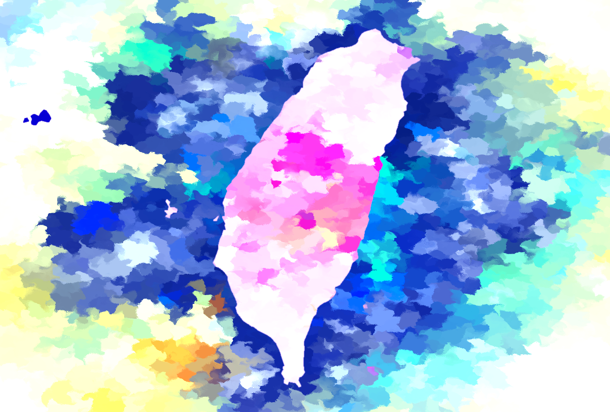

# I'm from Taiwan

> **Title**: "I'm from Taiwan"  
> **Author**: Zaron Chen  
> **Topic**: Where I live 📍  
> **Date**: 2023-04-09  
> **Last Updated**: 2024-02-14  
> **License**: CC BY-SA 3.0

---

---

> **Note**: The artwork includes a [modified version](./Prunus_mume.jpg) of the image ["Prunus mume"](https://commons.wikimedia.org/wiki/File:Prunus_mume.JPG) by [Kakidai](https://commons.wikimedia.org/wiki/User:Kakidai), which is licensed under the [Creative Commons Attribution-Share Alike 3.0 Unported](https://creativecommons.org/licenses/by-sa/3.0/deed.en) license.
