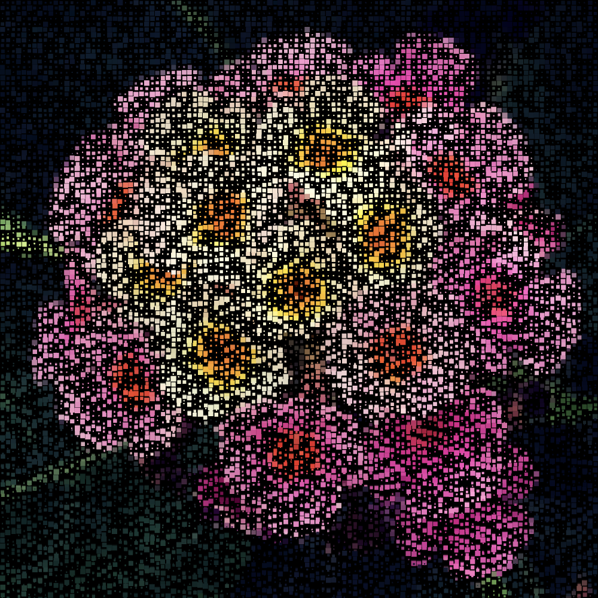
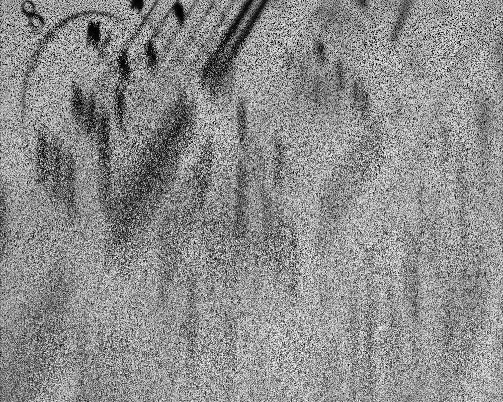
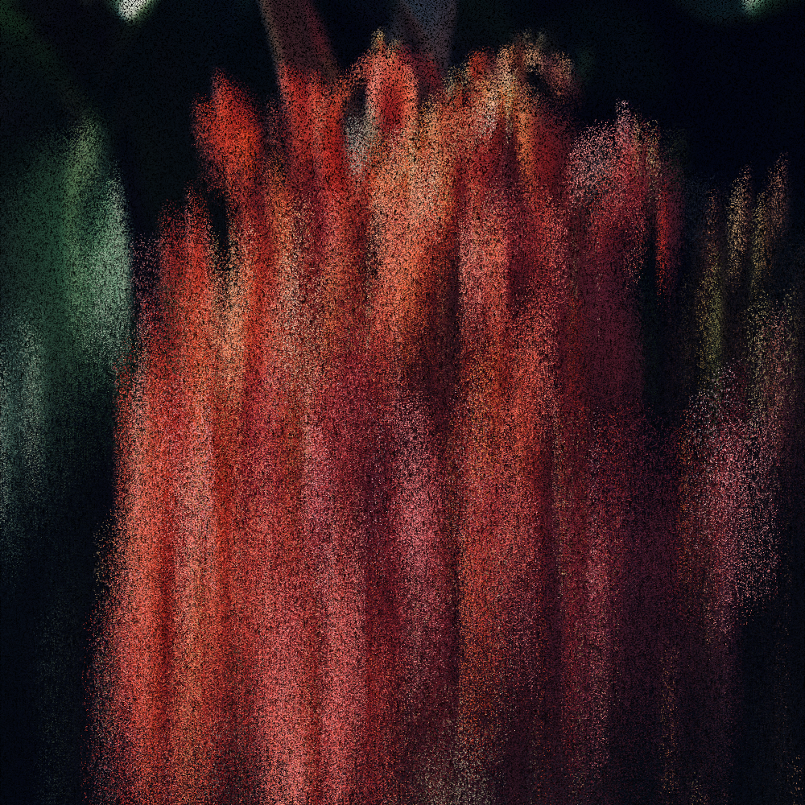
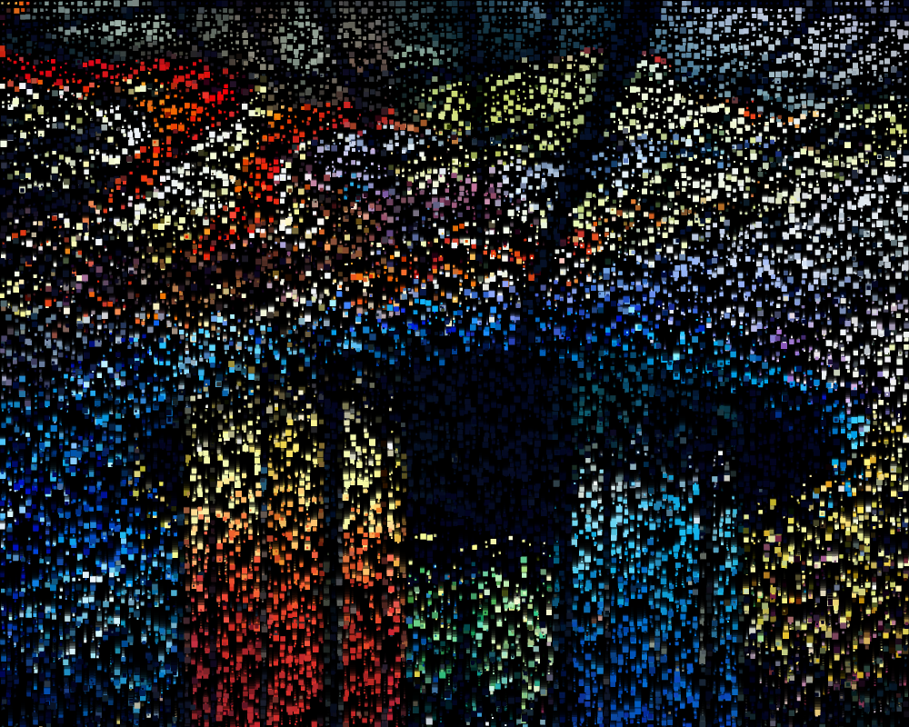
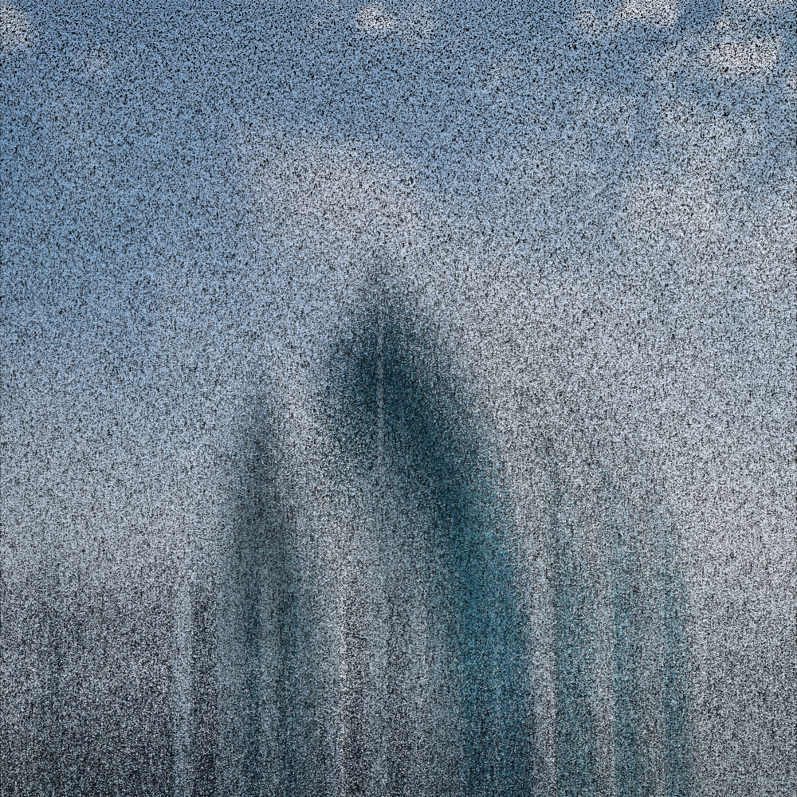
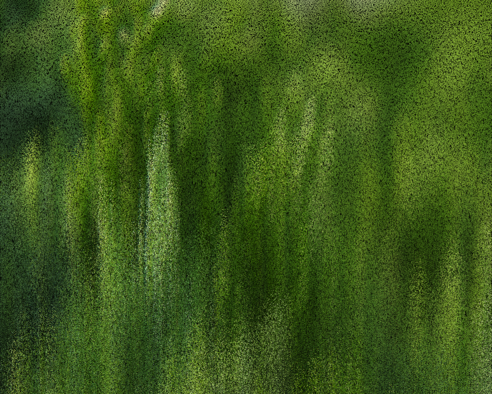

# Pixel Collapse

> **Title**: "Pixel Collapse"  
> **Author**: Zaron Chen  
> **Topic**: Falling 🍂 
> **Date**: 2023-10-01  
> **Last Updated**: 2024-02-20  
> **License**: CC BY-NC-SA 3.0

---

---

---

---

---

---

---

---

