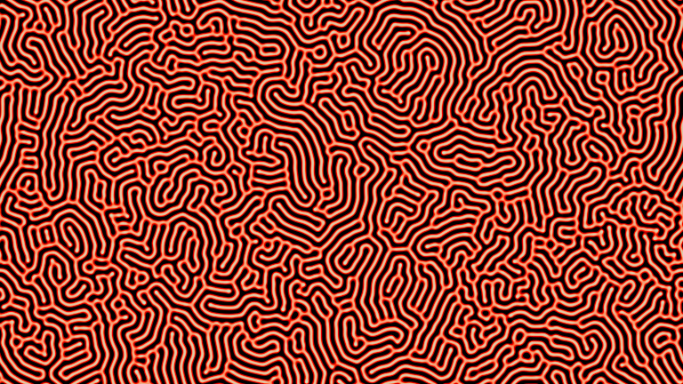

# Reaction-Diffusion

> **Title**: "Reaction-Diffusion"  
> **Author**: Zaron Chen  
> **Topic**: Iterations 🔄  
> **Date**: 2024-02-23  
> **Last Updated**: 2024-03-27  
> **License**: MIT License

---

---

---

---

---

---

---

---

---

---

---

---

---

###### Copyright © 2024 Zaron Chen
