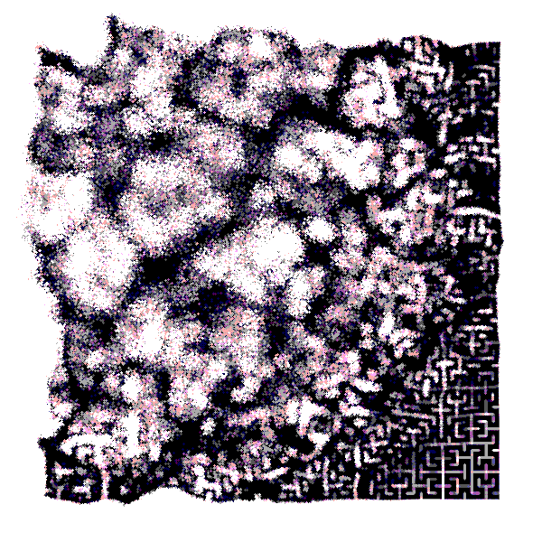

# WCCC-Sketches

## Hi!

This repository stores all my WCCChallenge sketches.  
You can see more of my other sketches on [my OpenProcessing Page](https://openprocessing.org/user/324002/).

## Join!

Join and learn more about WCCChallenge:

- [**sableraph Twitch**](https://www.twitch.tv/sableraph)
- [**Birb's Nest Discord**](https://discord.gg/nP2XJBGMeH)
- [**WCCChallenge Curation**](https://openprocessing.org/curation/78544)
- [**WCCChallenge Topics**](https://sableraph.notion.site/afe97ee95a1c4e2c9cc524b78aae6e45?v=66edd42672aa41e29d5a1aa8e0dc7cb2)

## Pinned

&NewLine;

&NewLine;

&NewLine;

&NewLine;

## License

Please refer to each folder's README.md for more details.
